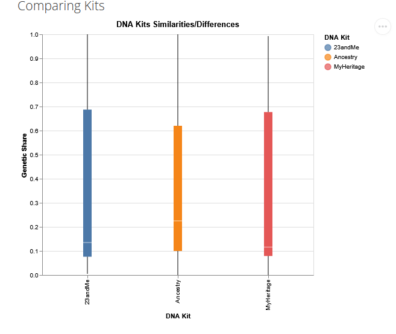
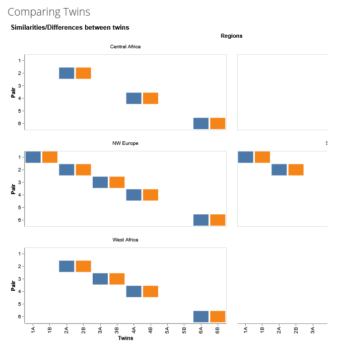
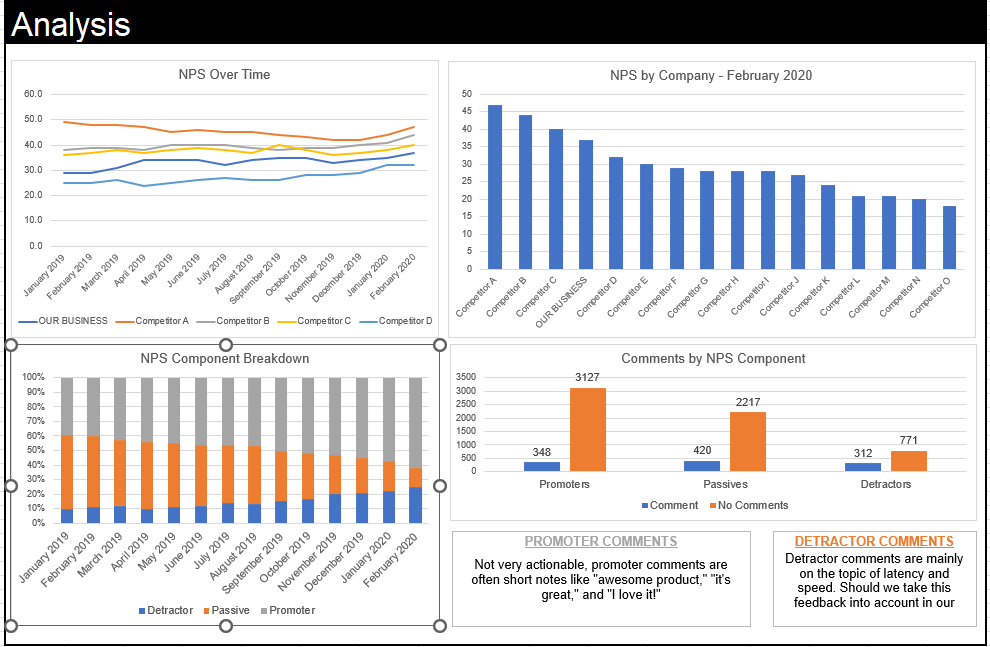
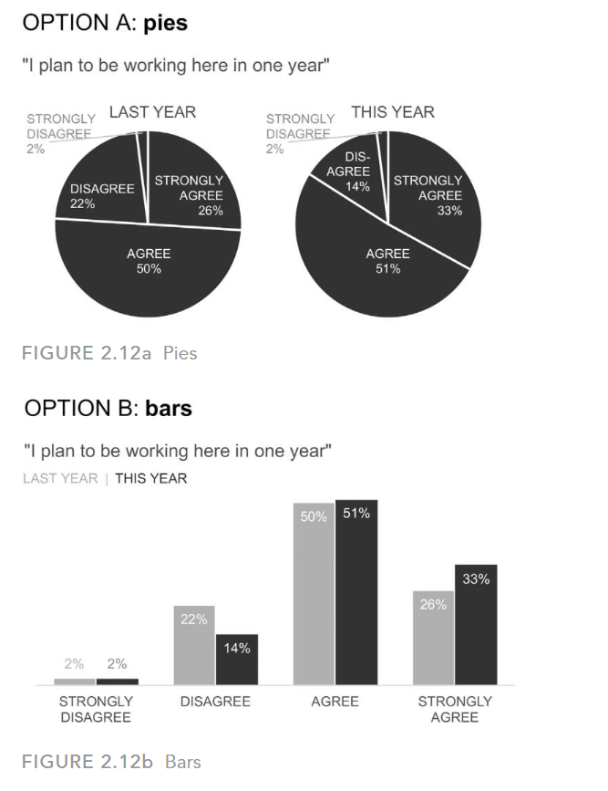
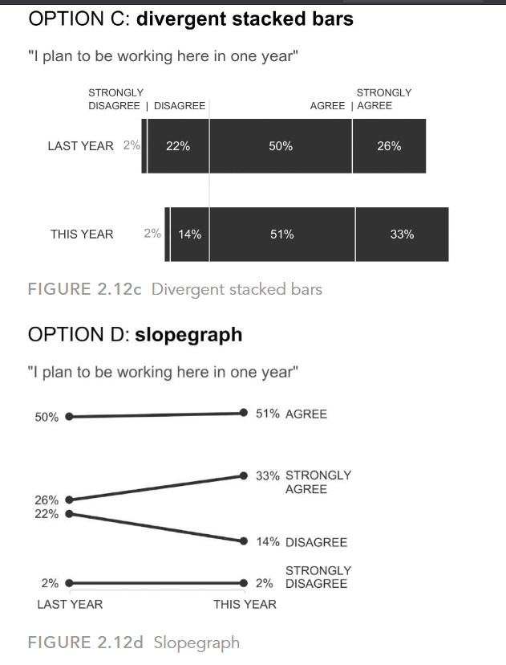

# Components of the portfolio

```{r, include = FALSE}
library(dplyr)
library(jsonlite)
library(tidyr)
library(vegabrite)
```

## Exercise 1 (HW 4 revision)

### A.



I like this graph because it's easy to compare the kits and see their differences. The colors are good, making it easy to tell each kit type apart. The layout is clean, which helps make the comparisons easily. The data isn't cluttered, which makes the graphic easy on the eyes.

### B.



I don't like this graph because it's hard to tell the kits apart. You need to scroll to see the legend, which is distracting and takes away from the story the graphic wants to tell us.

### C.

#### Kits

```{r, include = FALSE}
genes<-read.csv("https://calvin-data304.netlify.app/data/twins-genetics-long.csv")
str(genes)
```

```{r}
vl_chart(height = 400, width = 600) |>
  vl_mark_bar() |>
  vl_encode_x("pair:N", title = "Twin Pair ID #") |>
  vl_encode_y("genetic.share:Q", title = "Genetic Share") |>
  vl_encode_color("kit:N", scale = list(scheme = "category10")) |>
  vl_facet_column("id:N",title = "Genetic Share Across Twin Pairs by Kit") |>
  vl_encode_xOffset("kit")|>
  vl_add_data(genes)


```

This bar graph highlights that, although twins tend to share nearly all their DNA, small variations do occur. By creating a side-by-side bar graph, it's easier for the human eye to compare these variations. I hope that this graphic can help explain differences between twins, such as their appearance and health.

```{r}
vl_chart(height = 500, width = 700, title = "Genetic Similarity Across DNA Test Kits") |>
  vl_mark_rect()|>  
  vl_encode_x("kit:N", title = "DNA Test Kit") |>
  vl_encode_y("pair:N", title = "Twin Pair") |>
  vl_encode_color("genetic.share:Q", scale = list(scheme = "viridis"), title = "Genetic Share") |>  
  vl_add_data(genes)


```

This heat map shows the discrepancies in how different DNA test kits report genetic share for each twin pair. The color palette represents the reported genetic share, with darker colors indicating lower similarity and lighter colors indicating higher similarity. This graphic highlights the potential inconsistency of the DNA testing kits.

## Exercise 2 (Data and graphics challenge)



-   How our business compares to other businesses (over time and in February 2020):

-   Business's Net Promoter Score (NPS) compares to other businesses over time, showing trends from January 2019 to February 2020. This analysis allows us to see how business's NPS has evolved compared to the competition. By examining these trends, we can identify periods where the business performed well and pinpoint times that may have had challenges. In February 2020 specifically, we can see NPS in relation to competitors, providing a snapshot of the market position at that time.

-   How the components of the net promoter score for our business have changed over time:

-   The NPS components for the business (Detractors, Passives, Promoters) have changed from January 2019 to February 2020. By analyzing these changes, we gain insights into customer sentiment. For example, an increase in Promoters indicates higher customer satisfaction and loyalty, while an increase in Detractors suggests areas that need improvement. This breakdown helps us understand how the composition of NPS score has evolved.

## Exercise 3 (A new challenge)

```{r}
tanzania<-read.csv("tanzaniaDataSet.csv")
str(tanzania)
```

### Data wrangling

```{r}
# Renaming the variables
tanzania_clean <- tanzania |>
  rename(
    Survey_Year = DHS.Survey.Year,
    Total_fertility_Rate = Total.Fertility.Rate..ages.15.49.,
    Contraception_Rate = Contraception....,
    Unmet_Planning_Rate = Unmet.Planning....
  )
# Dealing with the years
tanzania_split <- tanzania_clean |>
 separate(Survey_Year, into = c("start_year", "end_year"), sep = "-", fill = "right") |>
  # Convert to integers
  mutate(
    start_year = as.integer(start_year),
    end_year = ifelse(is.na(end_year), start_year, as.integer(end_year))
  ) |>
  # Replicate data for each year in the range
  rowwise() |>
  mutate(year = list(seq(start_year, end_year))) |>
  unnest(cols = c(year)) |>
  select(-start_year, -end_year)

# Displaying the data frame
tanzania_split
```

```{r}
#Arrage by year ascending
sorted_tanzania_split <- tanzania_split |>
  arrange(year)
#converting to long
sorted_tanzania_split_long <- sorted_tanzania_split |>
  pivot_longer(cols = c(Total_fertility_Rate, Contraception_Rate, Unmet_Planning_Rate),
               names_to = "variable", values_to = "value")

sorted_tanzania_split_long$variable <- factor(sorted_tanzania_split_long$variable)

sorted_tanzania_split_long$year <- as.numeric(sorted_tanzania_split_long$year)

sorted_tanzania_split_long$year <- as.numeric(as.character(sorted_tanzania_split_long$year))

sorted_tanzania_split_long$variable <- gsub("_", " ", sorted_tanzania_split_long$variable)
str(sorted_tanzania_split_long)

sorted_tanzania_split_long <- sorted_tanzania_split_long |>
  group_by(year) |>
  mutate(proportion = value / sum(value)) |>
  ungroup()
```

### Graphic

```{r}
sorted_tanzania_split_long <- as.data.frame(sorted_tanzania_split_long)

line_chart <- vl_chart(height = 400, width = 600) |>
  vl_mark_line(point = TRUE) |>
  vl_encode_x("year", type = "ordinal", axis = list(labelAngle = 0), title = "") |>
  vl_encode_y("value", type = "quantitative", title = "Rate (%)") |>
  vl_add_data(sorted_tanzania_split_long) 

line_chart <-line_chart |>
  vl_encode_color("variable", type = "nominal", title = "Variable") |>
  vl_add_point_selection("variable_param", bind = "legend", encodings = list("color") )|>
  vl_encode_opacity(value = 0.2) |>
  vl_condition_opacity(param = "variable_param", value = 1)

line_chart


bar_chart <- vl_chart(height = 400, width = 600) |>
  vl_mark_bar() |>
  vl_encode_x("year", type = "ordinal", title = "") |>
  vl_encode_y("proportion", type = "quantitative", title = "Proportion") |>
  vl_add_data(sorted_tanzania_split_long) |>
  vl_encode_color("variable", type = "nominal", title = "Variable")
bar_chart


combined_chart <- vl_concat(
  line_chart,
  bar_chart,
 columns = 2
)

combined_chart

```

The story I am trying to tell with the graphic above is a simple one: how the different rates of patterns of reproductive health have evolved over time in Tanzania. For example, the fertility rate has dropped slightly since the first survey, while the contraception rate has increased almost exponentially, with the data stopping in the last two years.

## Exercise 4 (Your masterpiece)

```{r}
strokeData <- read.csv("strokeData.csv")
str(strokeData)
```

```{r}
strokeData$Age <- as.integer(strokeData$Age)
  
strokeData_select <- strokeData |>
  select(Age, BMI, Avg_Glucose, Stroke)  


interactive_plot <- vl_chart(height = 400, width = 600) |>
  vl_mark_circle() |>
  vl_encode_x("Avg_Glucose", type = "quantitative", title = "Average Glucose Level") |>  
  vl_encode_y("BMI", type = "quantitative", title = "BMI") |>
  vl_encode_color("Stroke", type = "nominal", title = "Stroke Status") |>
  vl_encode_tooltip_array(c("Avg_Glucose", "BMI", "Age", "Stroke")) |>
  vl_add_data(strokeData_select) |>
  
  vl_add_parameter("age_param", value = min(strokeData$Age)) |>
  vl_bind_range_input(
    parameter_name = "age_param", 
    name = "Age: ",                 
    min = min(strokeData$Age),
    max = max(strokeData$Age)
  ) |>
  vl_filter("datum.Age <= age_param") |>
  
  vl_encode_opacity(
    condition = list(test = "datum.Stroke == 0", value = 0.2),  
    value = 1  
  )

interactive_plot


```

```{r}
interactive_plot <- vl_chart(height = 400, width = 600) |>
  vl_mark_boxplot() |>
  vl_encode_x("Smoking_Status", type = "nominal", title = "Smoking Status") |>
  vl_encode_y("Avg_Glucose", type = "quantitative", title = "Average Glucose Level") |>
  vl_encode_color("Stroke", type = "nominal", title = "Stroke Status") |>
  vl_encode_tooltip_array(c("Smoking_Status", "Avg_Glucose", "Stroke")) |>
  vl_encode_xOffset("Smoking_Status")|>
  vl_add_data(strokeData)

interactive_plot


```

```{r}
# Convert categorical variables to factors
strokeData <- strokeData |>
  mutate(Gender = as.factor(Gender),
         SES = as.factor(SES),
         Smoking_Status = as.factor(Smoking_Status),
         Hypertension = as.factor(Hypertension),
         Heart_Disease = as.factor(Heart_Disease),
         Diabetes = as.factor(Diabetes),
         Stroke = as.factor(Stroke))  

# Fit Logistic Regression Model
stroke_model <- glm(Stroke ~ Age + Gender + SES + Hypertension + Heart_Disease + 
                     BMI + Avg_Glucose + Diabetes + Smoking_Status, 
                     data = strokeData, family = binomial)

# Predict stroke probabilities
strokeData_select$predicted_prob <- predict(stroke_model, type = "response")

# Create a Vega-Lite visualization
stroke_scatter <- vl_chart(height = 400, width = 600) |>
  vl_mark_circle() |>
  vl_encode_x("Age", type = "quantitative", title = "Age") |>  
  vl_encode_y("predicted_prob", type = "quantitative", title = "Predicted Stroke Probability") |>
  vl_encode_tooltip_array(c("Age", "predicted_prob", "BMI")) |>
  vl_add_data(strokeData_select)
# Fit LOESS model
loess_fit <- loess(predicted_prob ~ Age, data = strokeData_select, span = 0.5)

# Create a new dataset with smoothed values
stroke_loess <- data.frame(
  Age = strokeData_select$Age,
  predicted_smooth = predict(loess_fit, newdata = strokeData_select)
)
# Loess graphic
loess_line <- vl_chart() |> 
  vl_mark_line(color = "red", opacity = 0.8) |>
  vl_encode_x("Age", type = "quantitative") |>  
  vl_encode_y("predicted_smooth", type = "quantitative") |>
  vl_add_data(stroke_loess)

# Layering
final_plot <- vl_layer(stroke_scatter, loess_line)
final_plot
```

I decided to use a basic stroke data set because a while back my dad had 5 strokes and he had many of the condtions mentioned in the data set from heart diesea, hypertension, he was also a former smoker and he is also diabeteic and it is because he didnt take care of the diabeites the avgerage glucuse was pretty high. So, the combination of all these factors caused him to have a stroke

## Exercise 5 (Using your palette):

a.  an encoding channel other than x or y:

    For most of my graphics I use other channels of encoding. For example in the tanzania graphic I use encode for opacity so that when I select one of the rates the other rates become less opaque.

b.  layers:

    In my "master piece" I use layer to layer a scatter plot and loess line to make the predictions easier to see.

c.  facets:

    In the first twins' graphic, I use a facet to obtain two different graphics that are faceted by the identity of the twins.

d.  concatenation or repeat:

    Again, in the Tanzania example, use a concatentiaon to show both the trend of rates over time and then on the left show the proportions of the rates per year.

e.  non-default settings for a channel’s scale or guide:

    In the heatmap example, I use a non-default scale for the color to highlight the difference between the genetics kits.

f.  tooltips:

    I used tooltips for my graphics on "my master piece" so that when you hover with the mouse, you can observe multiple variables of the dataset per data point.

g.  another kind of interaction (panning/zooming, brushing, sliders, etc.):

    Used a couple of interactions in a coupl ofe graphs. For example, for the Tanzania line graph, I binded the legend to the opacity so that when the user selects one of the rates on the legend, the other two become less opaque. Another is on the first graphic of the strokes data set I used a slider for the age to observe the data points per age.

## Exercise 6 (Keep learning)

a.  

    -   

    -   

b.  

## HW 4-Exercise 2.12:

 

-   QUESTION 1: What do you like about each graph? What can you easily see or compare?

-   QUESTION 2: What is difficult about the given view? Are there limitations or other considerations of which to be aware?

-   QUESTION 3: If you were tasked with communicating this data, which option would you choose and why?

-   QUESTION 4: Grab a friend or colleague and talk through the various options together. Do they agree with your preferred view, or is there a preference for another? Did your discussion highlight anything interesting that you hadn’t previously considered?
